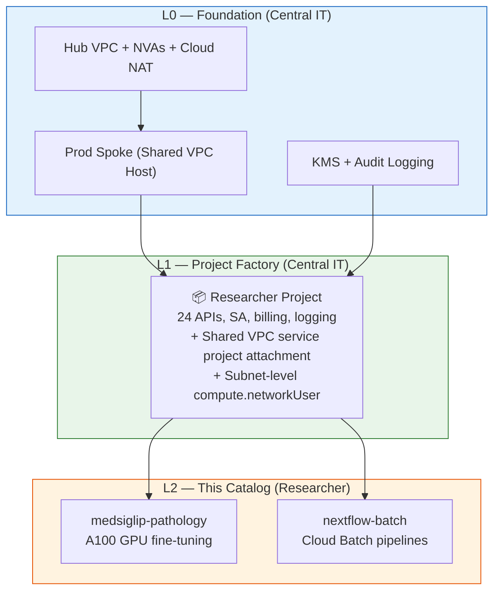

# Fast Science L2 — Workload Catalog

A catalog of science workloads that researchers deploy in GCP projects provisioned by [L1](https://github.com/WandLZhang/fast-science-1-researcher-lab). Each workload is a self-contained folder with a `deploy.py` that provisions resources within the researcher's project using the L0 shared subnet.

## Prerequisites

1. **L0** deployed — [fast-science-0-stellar-engine](https://github.com/WandLZhang/fast-science-0-stellar-engine) (org, networking, security)
2. **L1** project created — [fast-science-1-researcher-lab](https://github.com/WandLZhang/fast-science-1-researcher-lab) (researcher project with APIs, SA, Shared VPC attachment, billing)
3. Environment variables from your admin (see each workload's README)

## Available Workloads

| Workload | Description | GPU | Key APIs |
|----------|-------------|-----|----------|
| [medsiglip-pathology](medsiglip-pathology/) | Fine-tune Google's MedSigLIP medical foundation model on NCT-CRC-HE-100K pathology dataset | A100 | aiplatform, notebooks |
| [nextflow-batch](nextflow-batch/) | Run Nextflow genomics pipelines (RNAseq) on Google Cloud Batch | No | batch, compute |

## How to Use

1. Pick a workload from the table above
2. Set your environment variables:
   ```bash
   export GCP_PROJECT_ID="<prefix>-dept-researcher"   # from L1
   export HOST_PROJECT="<prefix>-prod-net-host"       # from L0 Stage 2
   export GCP_REGION="us-central1"                    # from L0
   export SERVICE_ACCOUNT_NAME="<sa-from-l1-yaml>"    # from L1 YAML
   ```
3. Follow the workload's README

Each workload's `deploy.py` handles:
- Enabling any additional APIs needed
- Adding workload-specific IAM roles to the L1-created service account
- Org policy overrides (e.g., GPU driver compatibility)
- Provisioning compute resources (workbench, endpoints)
- Creating GCS buckets for pipeline artifacts

**Note:** The researcher running `deploy.py` needs only project-level permissions. All cross-project networking (Shared VPC attachment, subnet IAM) is handled by L0/L1 Terraform.

## Architecture



## Adding a New Workload

1. Create a new folder: `my-workload/`
2. Add `deploy.py` following the pattern from existing workloads
3. Add `requirements.txt` and `README.md`
4. In L1, create a project YAML with `shared_vpc_service_config` for subnet-level grants
5. Submit a PR

## Related Repos

| Layer | Repo | Purpose |
|-------|------|---------|
| **L0** | [fast-science-0-stellar-engine](https://github.com/WandLZhang/fast-science-0-stellar-engine) | GCP org landing zone |
| **L1** | [fast-science-1-researcher-lab](https://github.com/WandLZhang/fast-science-1-researcher-lab) | Researcher project provisioning |
| **L2** | This repo | Workload catalog for researchers |
